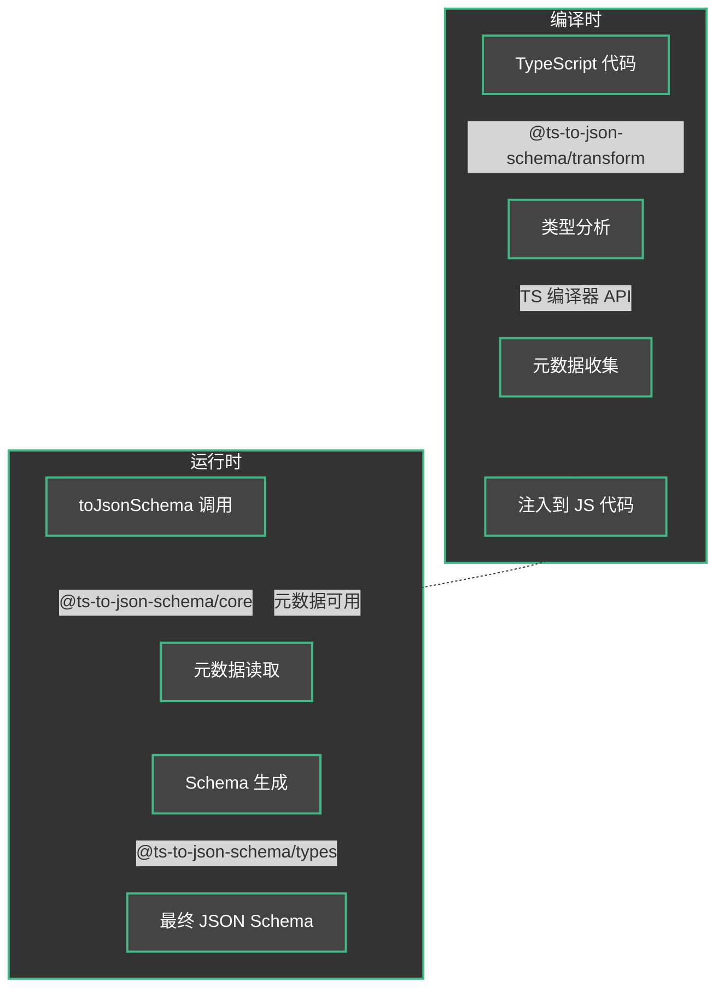

# 工作原理

TS to JSON Schema 使用一种独特的方法将 TypeScript 类型转换为 JSON Schema。该库不是在编译时或通过 CLI 工具生成 schema，而是在运行时工作，同时保持 TypeScript 的强类型。

## 架构

该库分为几个包，每个包都有特定的职责：

### @ts-to-json-schema/core

核心包提供了您在代码中使用的主要 `toJsonSchema` 函数。这个函数表面看起来很简单，但在内部它：

1. 捕获作为泛型参数使用的 TypeScript 类型的信息
2. 使用 transformer 收集的信息生成 schema
3. 应用定义的设置和自定义

### @ts-to-json-schema/transform

这是魔法发生的地方。transformer：

1. 在 TypeScript 编译期间运行
2. 使用 TypeScript 编译器 API 分析类型
3. 收集有关类型的元数据
4. 将元数据注入到编译后的代码中

### @ts-to-json-schema/types

包含包之间共享的类型定义，包括：

- 配置类型
- Schema 接口
- 实用类型

### @ts-to-json-schema/esbuild-plugin

提供 ESBuild 集成，允许：

- 自动 transformer 配置
- 构建过程优化
- 支持各种 ESBuild 配置

## 转换流程



## 执行流程

1. **编译时**
   - transformer 分析您的 TypeScript 代码
   - 收集类型信息
   - 将元数据注入到编译后的代码中

2. **运行时**
   - 您调用 `toJsonSchema<YourType>()`
   - 函数访问注入的元数据
   - 生成相应的 JSON Schema

## 详细示例

```typescript
// 1. 定义您的类型
interface User {
  id: number;
  name: string;
  email: string;
  profile?: {
    avatar: string;
    bio: string;
  };
}

// 2. 使用 toJsonSchema 函数
const schema = toJsonSchema<User>();

// 3. 生成的 schema 将包括：
// {
//   type: 'object',
//   properties: {
//     id: { type: 'number' },
//     name: { type: 'string' },
//     email: { type: 'string' },
//     profile: {
//       type: 'object',
//       properties: {
//         avatar: { type: 'string' },
//         bio: { type: 'string' }
//       },
//       required: ['avatar', 'bio']
//     }
//   },
//   required: ['id', 'name', 'email']
// }
```

## 这种方法的优势

1. **无需额外的构建步骤**
   - 无需运行生成器
   - 与开发流程自然集成

2. **强类型**
   - 保持 TypeScript 作为单一事实来源
   - 类型错误在编译时被捕获

3. **性能**
   - 元数据仅在编译期间生成一次
   - 运行时 schema 生成速度快

4. **灵活性**
   - 支持复杂类型
   - 可通过配置进行自定义 